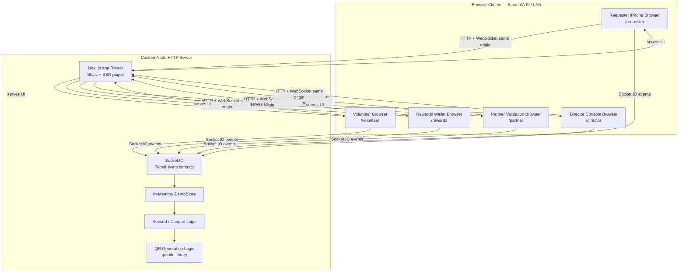

# Helpchain — Architecture & Block Diagram

## Overview

Helpchain runs as a **single custom Node.js HTTP server** that serves the Next.js App Router UI and a **Socket.IO** real-time layer on the **same port**. All demo state lives in an in-memory **DemoStore** on the server. Clients connect same-origin (localhost or LAN IP) and receive role-specific snapshots.

There is **no database** and **no external cloud requirement** for the core demo.

---

## Mermaid block diagram



---

## ASCII fallback diagram

```text
┌──────────────────── Browser Clients (LAN / localhost) ────────────────────┐
│  Requester iPhone    Volunteer Browser    Rewards Wallet    Partner       │
│  /requester          /volunteer           /rewards          /partner      │
│                                                                           │
│                    Director Console Browser  /director                      │
└───────────────────────────────┬───────────────────────────────────────────┘
                                │  HTTP + Socket.IO (same port, same origin)
                                ▼
┌──────────────── Custom Node HTTP Server ────────────────────────────────────┐
│  Next.js App Router          │          Socket.IO event handlers           │
│  (pages, assets, layout)     │          (demo:join, help:request:*,        │
│                              │           session:*, reward:*, director:*)  │
└──────────────────────────────┼─────────────────────────────────────────────┘
                               ▼
                    ┌──────────────────────┐
                    │  In-Memory DemoStore │
                    │  • active request    │
                    │  • volunteers        │
                    │  • sessions/ratings  │
                    │  • stars & coupons   │
                    │  • director event log│
                    └──────────┬───────────┘
                               │
              ┌────────────────┴────────────────┐
              ▼                                 ▼
    Reward / Coupon Logic              QR Generation Logic
    (catalogue, idempotency,           (Base64 data URLs
     redemption rules)                  for coupon codes)
```

---

## Component responsibilities

| Component | Responsibility |
|---|---|
| **Next.js App Router** | Renders six routes; Ubuntu typography; responsive UI; no server-side database |
| **Socket.IO** | Real-time join, state broadcast, session transitions, rewards, director controls |
| **DemoStore** | Single source of truth; validates transitions; first-accept-wins; star/coupon integrity |
| **Reward/Coupon logic** | Star deduction, Haven Café issuance, partner validation, duplicate rejection |
| **QR generation** | Server-side `qrcode` → data URL on coupon issue |
| **Director layer** | Sanitized snapshots, reset, four presentation scenarios, event timeline |

---

## Data / state flow

1. Client calls `demo:join` with role (requester, volunteer, partner, director).
2. Server registers connection and sends `demo:state` snapshot (or `director:state` for director).
3. Mutations (create request, accept, confirm, redeem) are **server-authoritative**.
4. After each mutation, server broadcasts updated snapshots to all connected clients.
5. **Server restart** clears all in-memory state; director reset restores baseline without restart.

---

## Real-time event flow (critical path)

```text
help:request:create → pending
help:request:accept → matched (first accept wins)
session:arrival:confirm → in_progress
session:completion:mark → awaiting_requester_confirmation
session:completion:confirm → completed + 1 star (once)
reward:redemption:create → coupon issued
coupon:redemption:submit → coupon redeemed (once)
director:demo:reset → baseline
```

---

## Simulation boundary

| Real production concern | Prototype approach |
|---|---|
| GPS / maps | Fixed demo location label + abstract radar |
| Voice input | Simulated transcript button |
| Partner scanner | Simulate scan + manual code entry |
| Persistence | In-memory only; restart or director reset |
| Auth | None — local demo trust model |

---

## Network notes

- Server binds **`0.0.0.0`** for LAN access.
- Terminal prints detected **IPv4 addresses** on startup.
- Socket client uses **same-origin** connection (no hardcoded LAN IP in app code).
